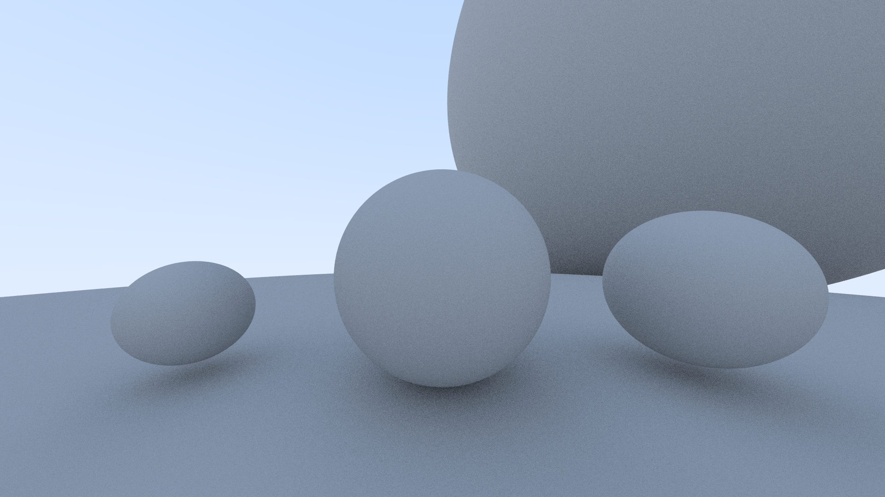

# Raytracing in one weekend
I followed [this](https://raytracing.github.io/books/RayTracingInOneWeekend.html) raytracing in one weekend guide. Instead of using C++ I decided to use Rust.
It's not entirely done yet but it can already produce an image.

# Preview
### Without denoising

### With denoising

